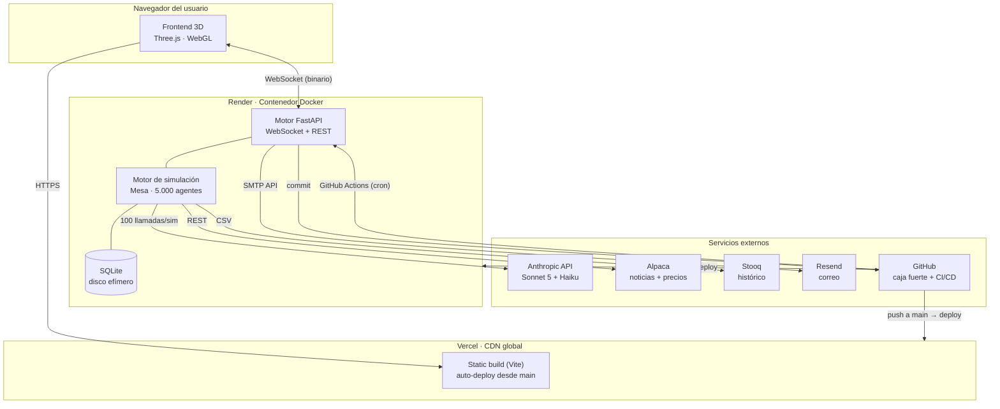

# El Enjambre — Documento de Arquitectura y Producto

**Rubicón Lab** · Versión 1.0 · 15 de julio de 2026
Documento técnico-ejecutivo. Cubre desde la infraestructura de despliegue
hasta los casos de uso de negocio. Cifras verificadas contra el código.

---

## 1. Resumen ejecutivo

**El Enjambre** es una plataforma de simulación de comportamiento de masas
del mercado bursátil. A partir de un titular de mercado real, simula en
tiempo real la reacción de **5.000 inversionistas sintéticos** —modelados
como agentes autónomos— y visualiza el resultado en una escena 3D. Es una
herramienta de **simulación y educación financiera** (B2B), no de asesoría
ni recomendación de inversión (cumplimiento regulatorio CMF Chile).

| Dimensión | Estado |
|---|---|
| **Madurez** | En producción, fase de pruebas y calibración |
| **Frontend** | Vercel — https://enjambre-ai-agents.vercel.app |
| **Backend** | Render — https://enjambre-motor.onrender.com |
| **Cobertura de pruebas** | 138 tests automatizados |
| **Núcleo de simulación** | 5.000 agentes (4.900 de reglas + 100 con IA) |
| **Diferenciador** | Visualización 3D + interpretación de noticias por IA |

---

## 2. Visión y propuesta de valor

### 2.1 El problema
Los mercados no se mueven solo por fundamentos: se mueven por **cómo la
masa interpreta y reacciona** a la información. Esa dimensión conductual
—pánico, euforia, contagio, manada— es invisible en las herramientas
tradicionales de análisis, que muestran el *qué* (el precio) pero no el
*por qué emocional*.

### 2.2 La solución
El Enjambre hace visible el comportamiento de la masa: el usuario ingresa
una noticia y observa cómo se propaga el sentimiento entre miles de
agentes con perfiles psicológicos distintos, hasta que el precio **emerge**
del cruce de sus órdenes. El resultado es un "focus group sintético del
mercado".

### 2.3 Propuesta de valor por segmento

| Segmento | Valor entregado |
|---|---|
| **Educación financiera** | Sesgos conductuales (aversión a pérdida, FOMO, efecto manada) hechos visibles y manipulables en aula. |
| **Fintech / neobrokers** | Widget embebible de engagement educativo: "así reaccionaría la masa a la noticia de hoy". |
| **Medios económicos** | Contenido visual y narrativo: el "duelo" de escenarios, la newsletter diaria, la hemeroteca de reacciones. |
| **Gestores de activos** | Estrés de tesis narrativas contra la reacción probable del mercado retail vs. institucional. |

---

## 3. Casos de uso

### 3.1 Funcionales (del usuario)
1. **Simulación on-demand** — un titular libre → reacción en vivo (~25 s).
2. **Muro diario** — las 3 noticias destacadas del día, ya simuladas.
3. **Hemeroteca ("El Enjambre dijo")** — archivo navegable, cada reacción
   con URL propia, 8 voces por arquetipo y epílogo "¿y qué pasó después?".
4. **Duelo** — dos escenarios enfrentados, exportable a video vertical 9:16.
5. **El Pulso** — newsletter diaria automática (análisis de mercado + las
   reacciones del día).
6. **Widget embebible** — iframe del enjambre del día para sitios de terceros.
7. **Observatorio** — sesión continua donde el enjambre "late" y recibe
   noticias encima en vivo.

### 3.2 Técnicos (del sistema)
- **Pipeline diario automatizado** (ritual de madrugada): recolección de
  noticias → clasificación → simulación → publicación → correo.
- **Calibración continua**: backtesting histórico + corrección contra el
  movimiento real del mercado.

---

## 4. Arquitectura de infraestructura

### 4.1 Topología de despliegue

### 4.2 Servicios y proveedores

| Capa | Proveedor | Rol | Plan actual |
|---|---|---|---|
| **Frontend / CDN** | Vercel | Hosting estático + edge CDN global | Free |
| **Backend / cómputo** | Render | Contenedor Docker (web service) | Free (⚠️ duerme + disco efímero) |
| **Inteligencia** | Anthropic | LLM: líderes (Sonnet 5) + portero (Haiku) | Pago por uso |
| **Datos de mercado** | Alpaca | Noticias (Benzinga) + barras de precio | Free tier |
| **Datos históricos** | Stooq | Series diarias pre-2016 (sin clave) | Público |
| **Datos de mercado (pro)** | Barchart | Datos para La Redacción | Pendiente |
| **Correo transaccional** | Resend | Envío de El Pulso | Pendiente |
| **Repositorio / CI/CD / respaldo** | GitHub | Código, automatización, caja fuerte de datos | Free |
| **Notificaciones** | Telegram | Avisos al operador (opcional) | Opcional |

### 4.3 Flujo de una simulación (extremo a extremo)
1. El usuario ingresa un titular en el frontend (Vercel).
2. El frontend abre un **WebSocket** contra el motor (Render).
3. El motor consulta a **Anthropic** (100 llamadas en paralelo, ≤ 25
   concurrentes): cada líder interpreta la noticia y emite señal.
4. Las señales se propagan por la red de influencia; el motor corre 150
   ticks; el precio emerge del libro de órdenes.
5. Cada tick se transmite como **frame binario** (5.008 bytes) por el
   WebSocket → el frontend anima el enjambre en 3D.
6. Al terminar, el motor persiste la simulación (SQLite) y envía el reporte.

### 4.4 CI/CD y automatización
- **Despliegue continuo:** cada `git push` a `main` dispara auto-deploy en
  Vercel (frontend) y Render (motor). Sin pipeline manual.
- **GitHub Actions:**
  - *Ritual diario* — de lunes a viernes a las 06:00 (Chile) despierta el
    motor y ejecuta el pipeline (llena el muro del día).
  - *Backtest* — a demanda, ejecuta tandas de calibración histórica.

### 4.5 Consideraciones de infraestructura conocidas
- **Disco efímero (plan free de Render):** el almacenamiento se reinicia en
  cada despliegue. Mitigado con una "caja fuerte" en GitHub para los datos
  de calibración; la hemeroteca completa requiere el disco persistente
  (upgrade planificado, ~USD 7/mes).
- **Cold start:** el plan free suspende el motor tras inactividad (~50 s de
  reactivación). Mitigado en el cliente con reconexión paciente y aviso al
  usuario.
- **Escalabilidad:** el rate-limiting y los topes viven hoy en memoria de
  una sola instancia; el salto a múltiples instancias requeriría un store
  compartido (Redis).

---

## 5. Arquitectura de software

### 5.1 Stack tecnológico

| Componente | Tecnología |
|---|---|
| **Motor de simulación** | Python 3.11 · Mesa 3 (agent-based modeling) |
| **API / servidor** | FastAPI · WebSocket · Uvicorn |
| **Persistencia** | SQLite (modo WAL) |
| **Frontend** | Vite · Three.js (WebGL) · GSAP · Tailwind CSS 4 |
| **Contenedor** | Docker (imagen no-root, dependencias fijas) |

### 5.2 El motor de simulación
Microestructura de mercado tipo **Chiarella-Iori**: el precio **emerge** del
libro de órdenes, no se impone. Toda orden es de tipo límite con "urgencia";
lo no ejecutado reposa y expira. El precio de cierre es la última
transacción. Un agente arbitrajista elimina tendencias predecibles para
preservar el realismo estadístico.

**Ciclo de una simulación:** 60 ticks de calentamiento (el mercado halla su
ritmo) → 10 ticks de calma → inyección de la noticia → 140 ticks de
reacción. Total transmitido: 150 frames.

### 5.3 El modelo de agentes (5.000)
Principio de diseño: la **cantidad** representa personas; el **capital
relativo** representa poder de mercado. Institucionales pocos pero con
capital 50-100×; retail numeroso pero de bajo capital individual.

| Grupo | Agentes | Ejemplos |
|---|---:|---|
| **Institucionales / profesionales** | 450 | fundamentalistas, quants, market makers, arbitrajistas |
| **Retail** | 4.450 | noise traders (2.000), manada (900), FOMO (600), miedosos (500)… |
| **Líderes de opinión (IA)** | 100 | 8 arquetipos que leen la noticia y propagan su señal |
| **Total** | **5.000** | |

Los **100 líderes** son los únicos que consultan la IA: cada uno emite una
señal ∈ [-1, +1] con una justificación en su voz. Están distribuidos en 8
arquetipos conductuales (institucional frío, quant escéptico, FOMO
evangelista, doomer, contrarian sabio, macro trader, influencer optimista,
value paciente), cada uno con su propio sesgo. La señal se propaga por una
**red de influencia scale-free (Barabási–Albert)** con retardo y
atenuación, lo que produce la "ola" visual característica.

**Tolerancia a fallos:** si la IA no está disponible, cada líder recae en
un motor léxico de respaldo (diccionario bilingüe). La simulación **nunca
se cae** por la API.

### 5.4 El frontend 3D
Renderizado por **instancing** (una sola llamada de dibujo para miles de
partículas). El motor simula 5.000 agentes; la capa visual puede renderizar
hasta 50.000 partículas (10 por agente) según la capacidad del dispositivo,
con un gobernador de FPS que degrada elegantemente para sostener 60 fps en
móvil de gama media. El color codifica el sentimiento (compra/venta), el
movimiento la decisión, y los líderes se distinguen como faros dorados.

### 5.5 Contrato de comunicación (motor ↔ frontend)
Protocolo binario sobre WebSocket para eficiencia: mensaje de inicio (texto,
con las voces de los líderes) → N frames binarios (`float32` precio +
`uint32` tick + `int8` × 5.000 sentimientos = 5.008 bytes/frame) → mensaje
de cierre con el reporte. El mismo formato de frame alimenta el muro, la
hemeroteca, el duelo y el widget (replay).

### 5.6 La capa de contenido
Sobre el motor se asienta una capa editorial autónoma:
- **Portero** (clasificador de 2 pisos: léxico + IA) que selecciona las
  noticias del día.
- **Pipeline** (ritual de madrugada) que orquesta recolección → simulación
  → publicación → correo, con validación humana antes del envío.
- **La Redacción** (3 roles: reportero / verificador / editor) que produce
  el análisis de mercado del boletín, donde el dato manda sobre la narrativa.

---

## 6. Datos y calibración

El Enjambre **no predice precios**; se **calibra** contra la realidad para
maximizar el realismo conductual (dirección, magnitud, volatilidad).

- **Corrección en vivo:** 1-2 días después de cada reacción destacada, el
  sistema mide el movimiento real del símbolo (Alpaca) y lo registra.
- **Backtesting histórico:** un catálogo de 55 eventos reales (2001-2025,
  balanceado entre alcistas, bajistas y neutros) se procesa por tandas
  acotadas —para controlar el costo de IA— y se compara con el movimiento
  real de la fecha (Alpaca → Stooq para lo anterior a 2016).
- **Libreta de calificaciones:** métricas de acierto direccional y de
  magnitud, separando datos en vivo de datos históricos.
- **Caja fuerte:** cada resultado se respalda de forma incremental en un
  repositorio GitHub, inmune a los reinicios del disco de cómputo.
- **Validación estadística:** una batería de pruebas verifica que la
  simulación reproduzca los "hechos estilizados" de mercados reales (colas
  gordas, clustering de volatilidad, asimetría de pánico, ausencia de
  autocorrelación de retornos).

---

## 7. Seguridad y cumplimiento

### 7.1 Seguridad de aplicación
- **Rate-limiting** por IP real (resolución tras proxy vía X-Forwarded-For).
- **Prevención de XSS:** escapado sistemático de todo dato no confiable
  (incluidas las salidas de IA) antes de insertarse en el DOM, con pruebas
  que lo custodian.
- **Validación de entradas:** identificadores con formato estricto, SQL
  100% parametrizado, defensa en profundidad contra path traversal.
- **Autenticación de operación:** los endpoints administrativos usan
  comparación de token en tiempo constante (anti-timing).
- **Contenedor endurecido:** ejecución no-root, dependencias con versión
  fija, imagen mínima.

### 7.2 Cumplimiento regulatorio (CMF Chile)
El producto se posiciona explícitamente como herramienta **educativa y de
simulación**, no de asesoría. Un filtro de vocabulario en código —con
pruebas automatizadas— impide lenguaje de recomendación de inversión en
toda pieza pública, y cada superficie lleva su descargo. La comparación con
datos reales de mercado se presenta siempre como ejercicio educativo, nunca
como predicción o validación.

---

## 8. Operación y observabilidad

- **Salud:** endpoint de healthcheck consumido por Render y por el
  despertador de GitHub Actions.
- **Diagnóstico:** endpoint administrativo que verifica la clave de IA con
  una llamada mínima y reporta la causa exacta de un fallo.
- **Trazabilidad:** el primer fallo de la API queda registrado en el log
  con su causa; toda simulación se persiste con su origen (IA vs. respaldo).
- **Automatización operativa:** el pipeline diario y las tandas de backtest
  se disparan por GitHub Actions (agenda + manual), operables incluso desde
  un teléfono.

---

## 9. Estado actual y roadmap

### 9.1 Completado
Motor de simulación y modelo de agentes · cerebros de IA · red de influencia
· visualización 3D · capa de contenido completa (muro, hemeroteca, duelo,
widget, newsletter) · identidad de marca · blindaje de seguridad · deploy en
producción · sistema de calibración (corrector + backtest + caja fuerte) ·
experiencia de usuario pulida (navegación, tour, controles 3D, canal B2B).

### 9.2 En curso
Calibración del mercado base (12 de 55 exámenes históricos rendidos; primera
ronda de ajuste de parámetros prevista con ~30-50 casos).

### 9.3 Próximos hitos

| Prioridad | Hito |
|---|---|
| **Operación** | Reanudar IA y calibración (recarga de saldo de Anthropic) |
| **Pre-lanzamiento** | Endurecer topes de uso · rotar credenciales · CSP del widget |
| **Producto** | Activar El Pulso (Resend) · datos pro de mercado (Barchart) · disco persistente |
| **Evolución** | Especialización por instrumento (acciones vs. commodities vs. cripto), sobre la base ya calibrada |
| **Crecimiento** | Materiales de captación (pitch para fondos: Start-Up Chile, CORFO, Platanus) |

---

## 10. Apéndice — parámetros clave

| Parámetro | Valor |
|---|---|
| Agentes simulados | 5.000 (4.900 reglas + 100 IA) |
| Partículas visuales máximas | 50.000 |
| Ticks por simulación | 60 calentamiento + 10 + 140 |
| Frames transmitidos | 150 (5.008 bytes c/u) |
| Llamadas de IA por simulación | ~100 (paralelas, ≤ 25 concurrentes) |
| Objetivo de rendimiento | 60 fps (móvil de gama media) |
| Eventos de backtest | 55 (2001-2025) |
| Pruebas automatizadas | 138 |
| Modelos de IA | claude-sonnet-5 (líderes) · claude-haiku-4-5 (portero) |

**Documentación relacionada:** `CLAUDE.md` (especificación del simulador),
`CONTENIDO.md` (capa de contenido), `docs/contexto.md` (estado de
desarrollo), `docs/ficha-tecnica.md` (referencia técnica),
`docs/despliegue.md` (guía de operación).

---
*Rubicón Lab · El Enjambre · Documento de Arquitectura y Producto v1.0 · 15 de julio de 2026*
